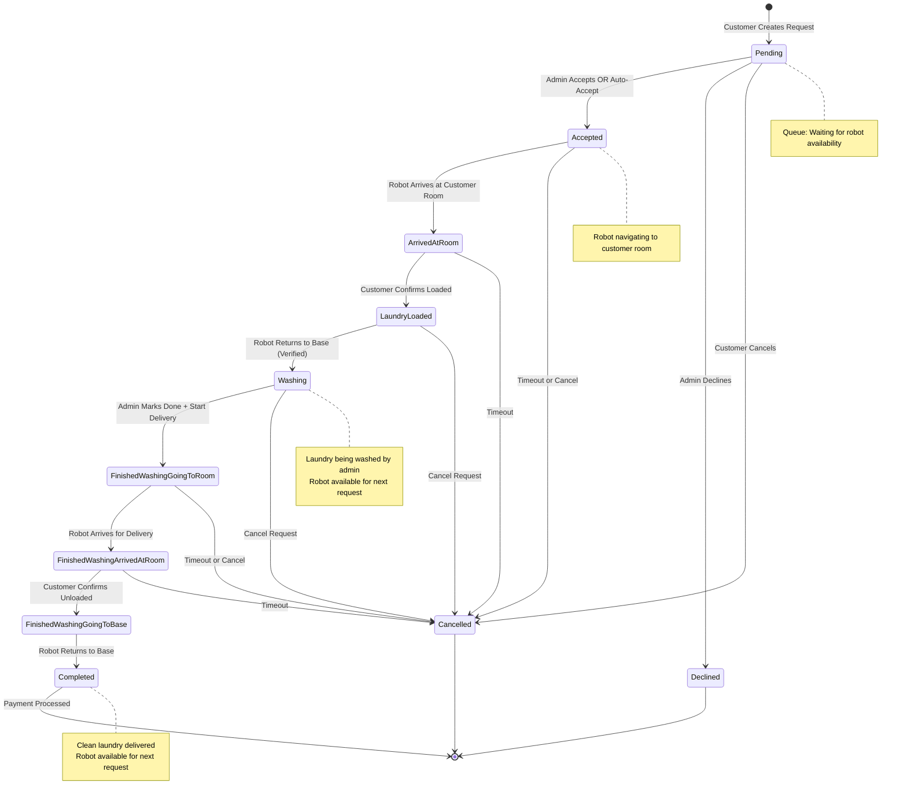
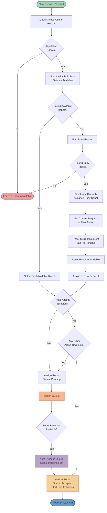
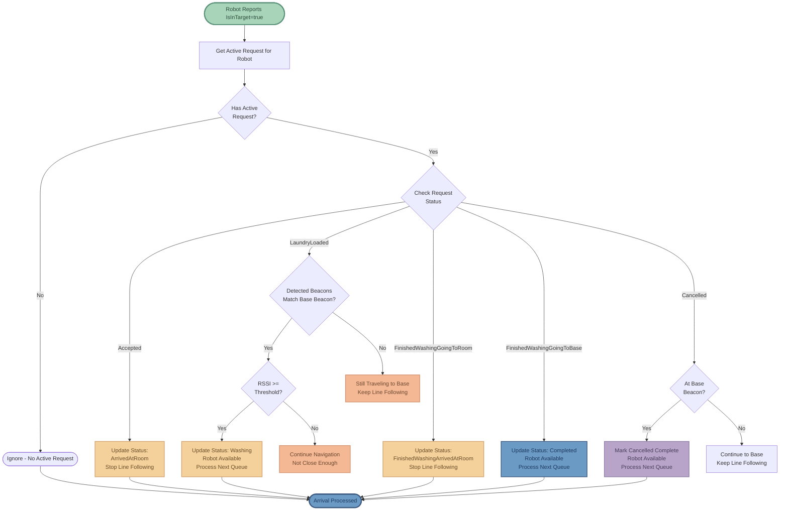
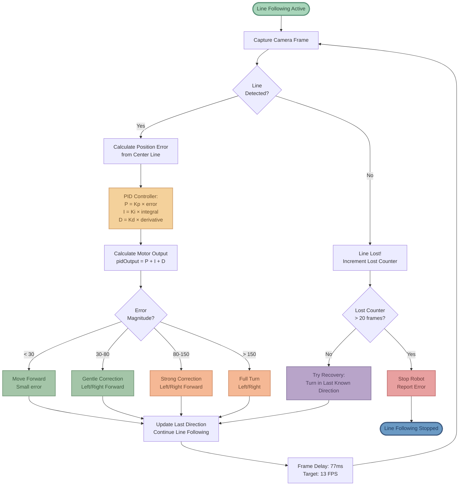
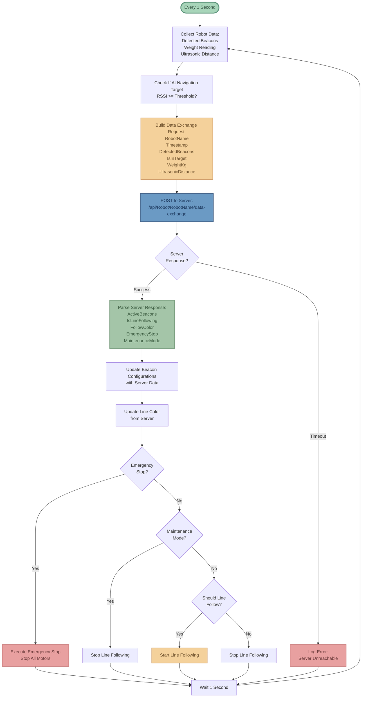
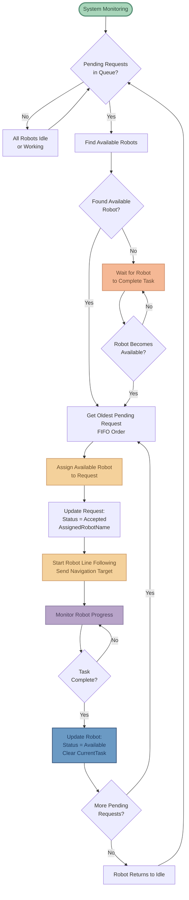
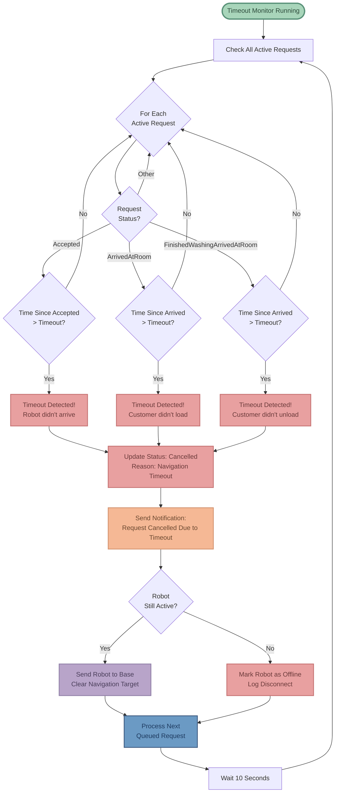
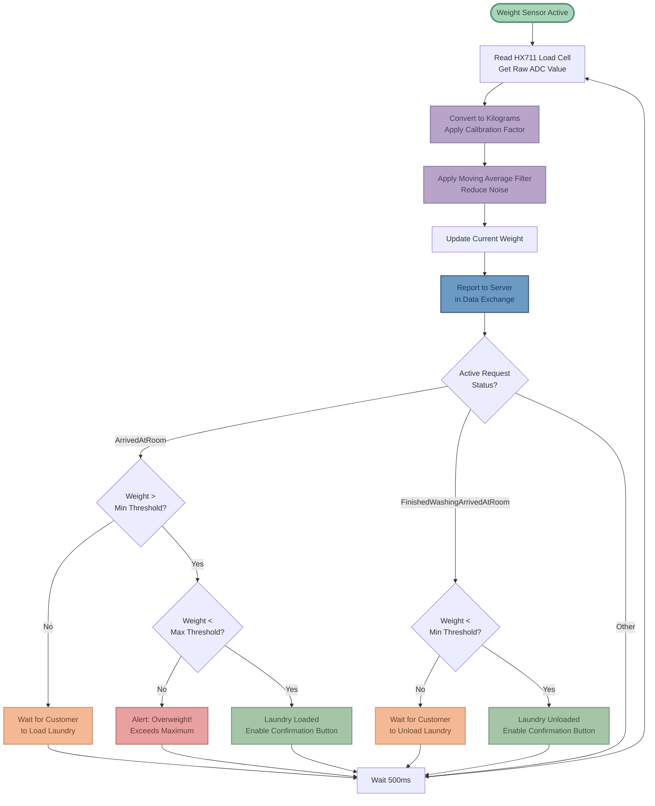
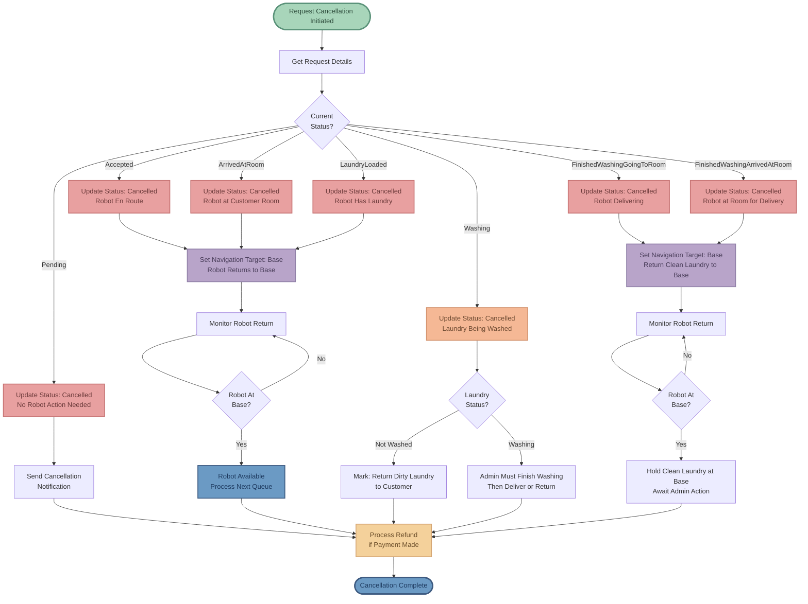
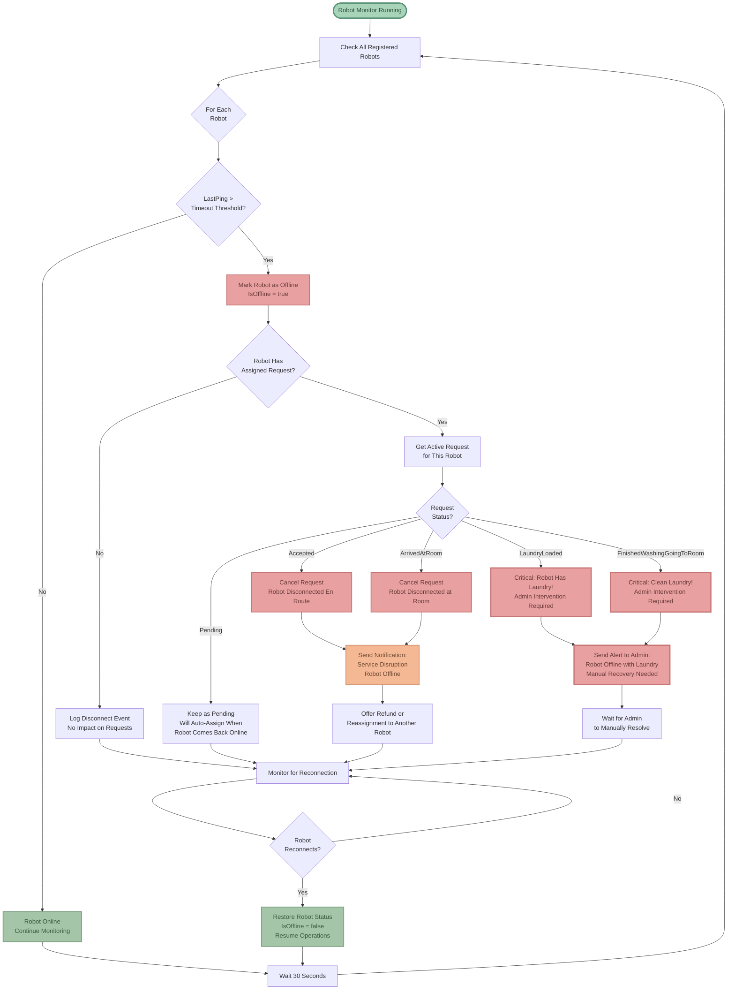

# Laundry Robot System - Algorithm Flowcharts

This document contains visual flowcharts for all major algorithms in the laundry robot system.

---

## 1. Complete Request Lifecycle

End-to-end flow from customer request creation to completion and payment.


---

## 2. Request Status State Machine

State diagram showing all possible status transitions and triggers.



---

## 3. Auto-Assignment & Queueing Algorithm

How robots are assigned to requests and queue management.



---

## 4. Robot Arrival Detection Algorithm

How the system determines when a robot has reached its destination.



---

## 5. Navigation Target Management

How beacon navigation targets are dynamically assigned based on request status.


---

## 6. Line Following Algorithm (PID Control)

Robot's core navigation using camera-based line detection and PID controller.



---

## 7. Beacon Scanning & Tracking

Bluetooth Low Energy beacon detection and RSSI tracking process.

```mermaid
flowchart TD
    Start([Beacon Scanner Started]) --> InitBluetooth[Initialize Bluetooth Adapter]

    InitBluetooth --> StartScan[Start BLE Scanning<br/>Continuous Mode]

    StartScan --> DetectDevice{BLE Device<br/>Detected?}

    DetectDevice -->|Yes| CheckUUID{Device has<br/>Beacon UUID?}
    CheckUUID -->|No| DetectDevice

    CheckUUID -->|Yes| ParseData[Parse Beacon Data:<br/>MAC Address<br/>RSSI<br/>UUID]

    ParseData --> CalcDistance[Calculate Distance<br/>from RSSI<br/>d = 10^((TxPower - RSSI) / 20)]

    CalcDistance --> CheckTracked{Already<br/>Tracking?}

    CheckTracked -->|No| AddNew[Add to Tracked Beacons<br/>Create New Entry]
    CheckTracked -->|Yes| UpdateExisting[Update Existing:<br/>RSSI<br/>Distance<br/>LastSeen Timestamp]

    AddNew --> CheckConfig{Has Server<br/>Configuration?}
    UpdateExisting --> CheckConfig

    CheckConfig -->|Yes| ApplyConfig[Apply Configuration:<br/>Name<br/>Room Name<br/>RSSI Threshold<br/>IsNavigationTarget]
    CheckConfig -->|No| UseDefaults[Use Default Values]

    ApplyConfig --> ReportToServer[Report to Server<br/>in Data Exchange]
    UseDefaults --> ReportToServer

    ReportToServer --> CheckStale[Check for Stale Beacons<br/>LastSeen > 10 seconds]

    CheckStale --> RemoveStale[Remove Stale Beacons<br/>from Tracking List]

    RemoveStale --> DetectDevice

    style Start fill:#A8D5BA,stroke:#5A9279,stroke-width:3px,color:#2C4A3A
    style StartScan fill:#F4D19B,stroke:#D4A574,stroke-width:2px,color:#6B4E2A
    style ParseData fill:#A4C5A8,stroke:#7A9E7F,stroke-width:2px,color:#3A5A3F
    style CalcDistance fill:#B8A4C9,stroke:#9181A8,stroke-width:2px,color:#4A3E5A
    style ApplyConfig fill:#F4D19B,stroke:#D4A574,stroke-width:2px,color:#6B4E2A
    style ReportToServer fill:#6B9AC4,stroke:#3D5A80,stroke-width:2px,color:#1E3A5F
```

---

## 8. Data Exchange Protocol

Bidirectional communication between robot and server.



---

## 9. Multi-Robot Coordination

How multiple robots share workload and process queued requests.



---

## 10. Timeout & Error Handling

Failure detection and recovery mechanisms.



---

## 11. Weight Validation Logic

Verify laundry loaded/unloaded using HX711 load cell sensor.



---

## 12. Cancellation Flow

What happens when a request is cancelled by customer or admin.



---

## 13. Offline Robot Handling

Robot disconnect detection and recovery.



---

## Color Legend

- 🟢 **Soft Green** - Start/Entry points
- 🔵 **Muted Blue** - Completion/Success states
- 🔴 **Soft Coral** - Errors/Rejections/Cancellations
- 🟡 **Soft Amber** - Active/In-progress states
- 🟣 **Soft Lavender** - Processing/Washing states
- 🟠 **Soft Peach** - Waiting/Queued states
- 🌿 **Muted Mint** - Information/Configuration states

---

## How to View

- **GitHub**: These diagrams will render automatically when viewing this file on GitHub
- **VS Code**: Install "Markdown Preview Mermaid Support" extension
- **Export to Images**: Copy the Mermaid code to https://mermaid.live/
- **Documentation**: Most modern documentation tools support Mermaid syntax
