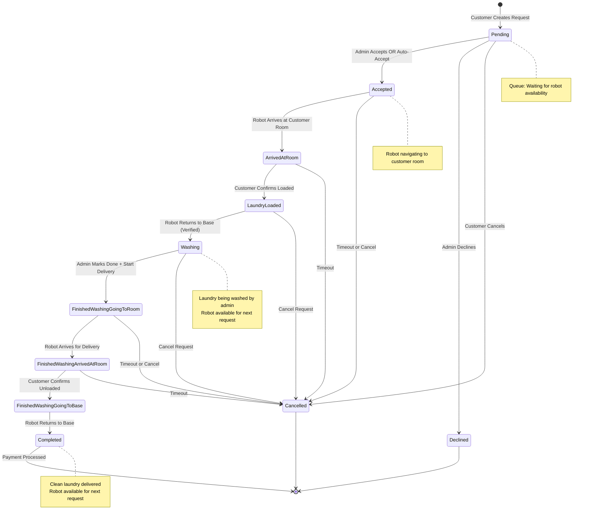
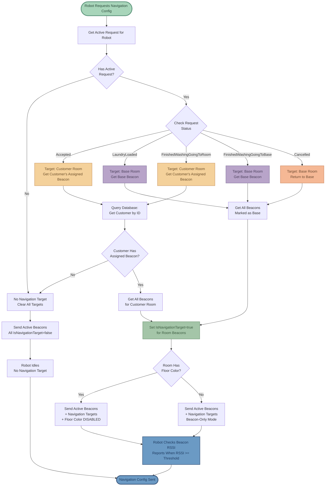

# Laundry Robot System - Algorithm Flowcharts

This document contains visual flowcharts for all major algorithms in the laundry robot system.

---

## 1. Complete Request Lifecycle

End-to-end flow from customer request creation to completion and payment.

```mermaid
flowchart TD
    Start([Customer Creates Request]) --> CheckDupe{Has Active<br/>Request?}
    CheckDupe -->|Yes| Reject([Reject: Duplicate Request])
    CheckDupe -->|No| AssignRobot[Auto-Assign Robot]

    AssignRobot --> CheckAvail{Robot<br/>Available?}
    CheckAvail -->|No| NoRobot([Reject: No Robots Available])
    CheckAvail -->|Yes| CheckAutoAccept{Auto-Accept<br/>Enabled?}

    CheckAutoAccept -->|No| Queue[Status: Pending<br/>Wait for Admin Approval]
    CheckAutoAccept -->|Yes| CheckBusy{Any Robot<br/>Busy?}

    CheckBusy -->|Yes| Queue
    CheckBusy -->|No| Accept[Status: Accepted<br/>Start Line Following]

    Queue --> AdminApprove{Admin<br/>Approves?}
    AdminApprove -->|No| Declined([Status: Declined])
    AdminApprove -->|Yes| Accept

    Accept --> Navigate1[Robot Navigates to Customer Room]
    Navigate1 --> Arrived1[Status: ArrivedAtRoom<br/>Wait for Customer Confirmation]

    Arrived1 --> CustomerLoad{Customer<br/>Loads Laundry?}
    CustomerLoad -->|Timeout| Timeout1([Status: Cancelled])
    CustomerLoad -->|Yes| Loaded[Status: LaundryLoaded<br/>Return to Base]

    Loaded --> Navigate2[Robot Returns to Base]
    Navigate2 --> BaseArrival[Verify at Base Beacon]
    BaseArrival --> Washing[Status: Washing<br/>Process Next Queue]

    Washing --> AdminWash[Admin: Mark Washing Done]
    AdminWash --> Delivery[Status: FinishedWashingGoingToRoom<br/>Deliver Clean Laundry]

    Delivery --> Navigate3[Robot Navigates to Customer Room]
    Navigate3 --> Arrived2[Status: FinishedWashingArrivedAtRoom<br/>Wait for Unloading]

    Arrived2 --> CustomerUnload{Customer<br/>Unloads?}
    CustomerUnload -->|Timeout| Timeout2([Status: Cancelled])
    CustomerUnload -->|Yes| Unloaded[Status: FinishedWashingGoingToBase<br/>Return to Base]

    Unloaded --> Navigate4[Robot Returns to Base]
    Navigate4 --> Complete[Status: Completed<br/>Process Next Queue]

    Complete --> Payment[Customer Pays]
    Payment --> End([Request Finished])

    style Start fill:#A8D5BA,stroke:#5A9279,stroke-width:3px,color:#2C4A3A
    style End fill:#6B9AC4,stroke:#3D5A80,stroke-width:3px,color:#1E3A5F
    style Reject fill:#E8A0A0,stroke:#C67373,stroke-width:2px,color:#6B3A3A
    style NoRobot fill:#E8A0A0,stroke:#C67373,stroke-width:2px,color:#6B3A3A
    style Declined fill:#E8A0A0,stroke:#C67373,stroke-width:2px,color:#6B3A3A
    style Timeout1 fill:#E8A0A0,stroke:#C67373,stroke-width:2px,color:#6B3A3A
    style Timeout2 fill:#E8A0A0,stroke:#C67373,stroke-width:2px,color:#6B3A3A
    style Accept fill:#F4D19B,stroke:#D4A574,stroke-width:2px,color:#6B4E2A
    style Loaded fill:#F4D19B,stroke:#D4A574,stroke-width:2px,color:#6B4E2A
    style Washing fill:#B8A4C9,stroke:#9181A8,stroke-width:2px,color:#4A3E5A
    style Delivery fill:#F4D19B,stroke:#D4A574,stroke-width:2px,color:#6B4E2A
    style Complete fill:#6B9AC4,stroke:#3D5A80,stroke-width:3px,color:#1E3A5F
```

---

## 2. Request Status State Machine

State diagram showing all possible status transitions and triggers.

---

## 3. Auto-Assignment & Queueing Algorithm

How robots are assigned to requests and queue management.

---

## 4. Robot Arrival Detection Algorithm

How the system determines when a robot has reached its destination.

---

## 5. Navigation Target Management

How beacon navigation targets are dynamically assigned based on request status.

---

## Color Legend

- 🟢 **Soft Green** - Start/Entry points
- 🔵 **Muted Blue** - Completion/Success states
- 🔴 **Soft Coral** - Errors/Rejections/Cancellations
- 🟡 **Soft Amber** - Active/In-progress states
- 🟣 **Soft Lavender** - Processing/Washing states
- 🟠 **Soft Peach** - Waiting/Queued states
- 🌿 **Muted Mint** - Information/Configuration states

---

## How to View

- **GitHub**: These diagrams will render automatically when viewing this file on GitHub
- **VS Code**: Install "Markdown Preview Mermaid Support" extension
- **Export to Images**: Copy the Mermaid code to https://mermaid.live/
- **Documentation**: Most modern documentation tools support Mermaid syntax
