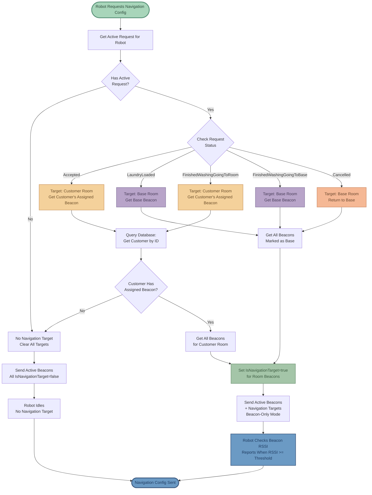
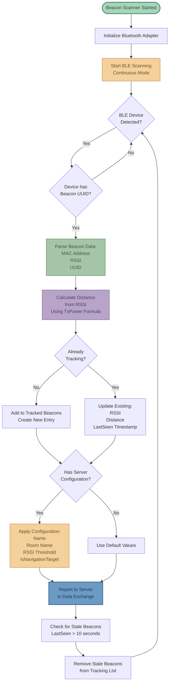
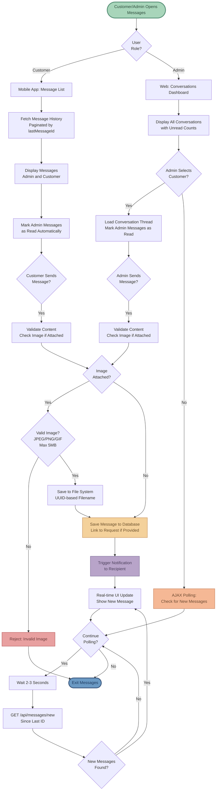
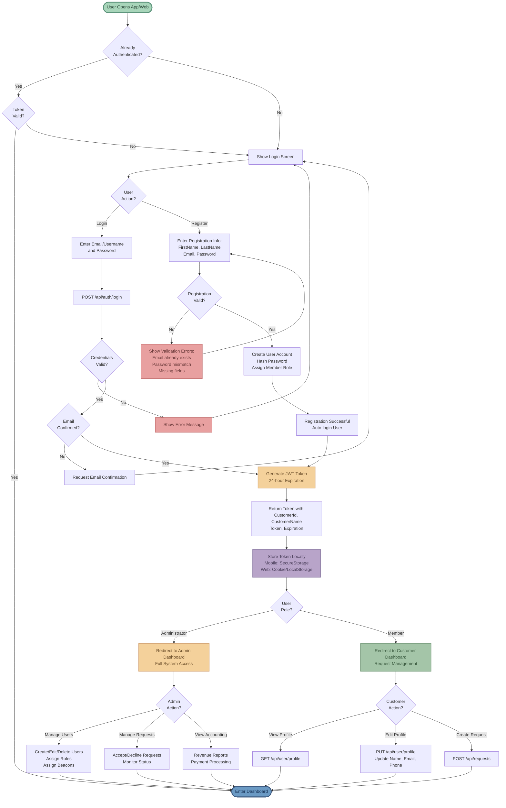
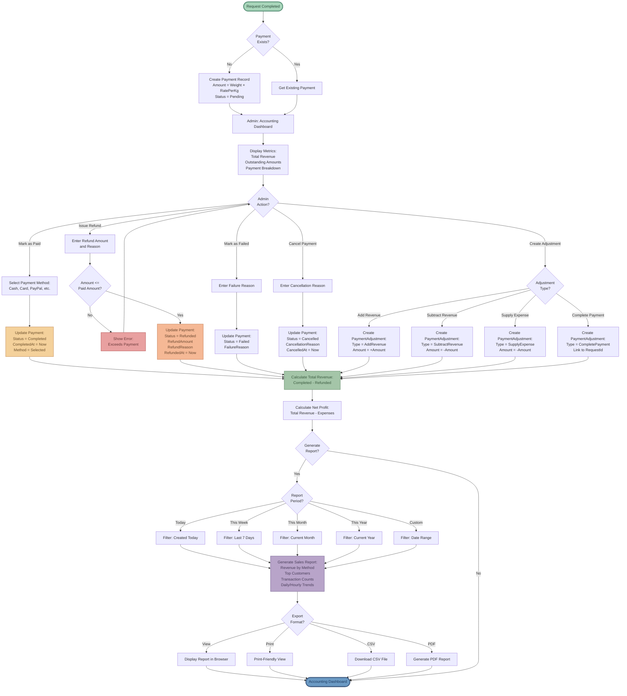
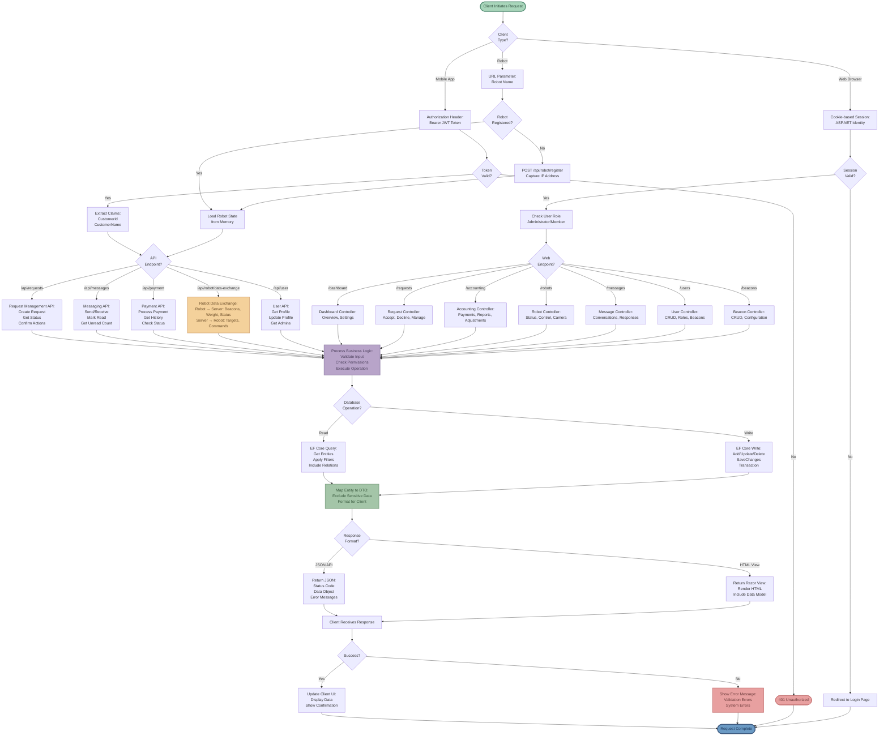
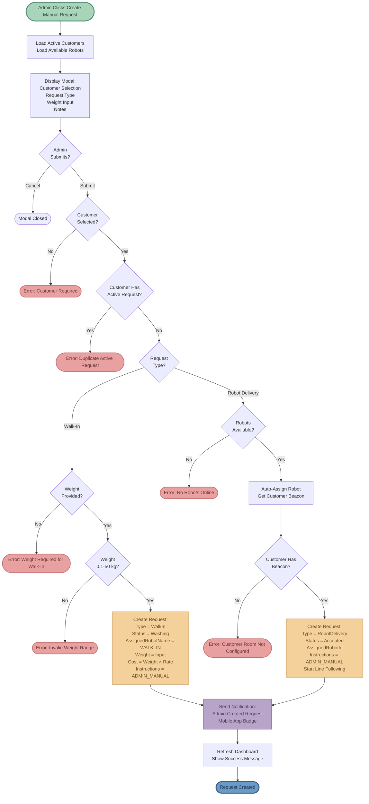
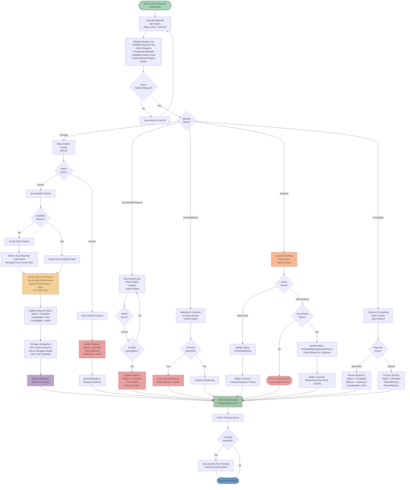

# Laundry Robot System - Algorithm Flowcharts

This document contains visual flowcharts for all major algorithms in the laundry robot system.

---

## 1. Complete Request Lifecycle

End-to-end flow from customer request creation to completion and payment.

---

## 2. Request Status State Machine

State diagram showing all possible status transitions and triggers.

---

## 3. Auto-Assignment & Queueing Algorithm

How robots are assigned to requests and queue management.

---

## 4. Robot Arrival Detection Algorithm

How the system determines when a robot has reached its destination.

---

## 5. Navigation Target Management

How beacon navigation targets are dynamically assigned based on request status.

---

## 6. Line Following Algorithm (PID Control)

Robot's core navigation using camera-based line detection and PID controller.

---

## 7. Beacon Scanning & Tracking

Bluetooth Low Energy beacon detection and RSSI tracking process.

---

## 8. Data Exchange Protocol

Bidirectional communication between robot and server.

---

## 9. Multi-Robot Coordination

How multiple robots share workload and process queued requests.

---

## 10. Timeout & Error Handling

Failure detection and recovery mechanisms.

---

## 11. Weight Validation Logic

Verify laundry loaded/unloaded using HX711 load cell sensor.

---

## 12. Cancellation Flow

What happens when a request is cancelled by customer or admin.

---

## 13. Offline Robot Handling

Robot disconnect detection and recovery.

---

## 14. Message & Notification System

Two-way communication between customers and administrators with real-time updates.

---

## 15. User Authentication & Management

Customer registration, login, and profile management with JWT token authentication.

---

## 16. Payment & Accounting Workflow

Complete financial management from payment processing to revenue reporting.

---

## 17. API Architecture & Data Exchange

Bidirectional communication between mobile app, robot, and web server.

---

## 18. Manual Request Creation (Admin-Initiated)

Admin-created manual requests for walk-in customers or assisted requests.

---

## 19. Admin Request Management

Administrator workflow for accepting, declining, and managing laundry requests.

---

## Color Legend

- 🟢 **Soft Green** - Start/Entry points
- 🔵 **Muted Blue** - Completion/Success states
- 🔴 **Soft Coral** - Errors/Rejections/Cancellations
- 🟡 **Soft Amber** - Active/In-progress states
- 🟣 **Soft Lavender** - Processing/Washing states
- 🟠 **Soft Peach** - Waiting/Queued states
- 🌿 **Muted Mint** - Information/Configuration states

---

## How to View

- **GitHub**: These diagrams will render automatically when viewing this file on GitHub
- **VS Code**: Install "Markdown Preview Mermaid Support" extension
- **Export to Images**: Copy the Mermaid code to https://mermaid.live/
- **Documentation**: Most modern documentation tools support Mermaid syntax
